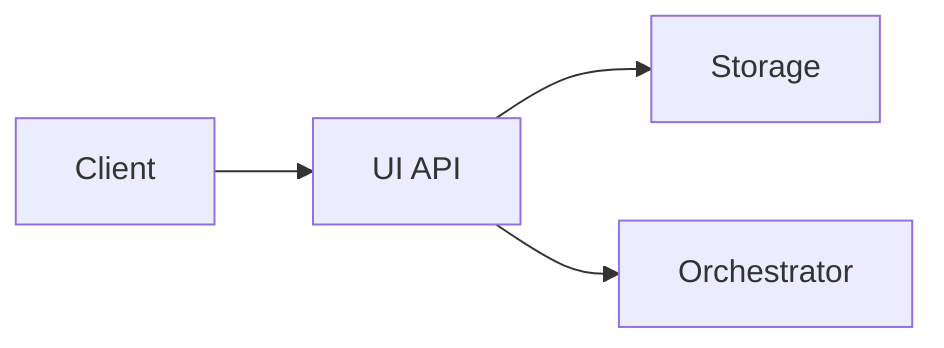

# Writing Markdown

Conventions for all markdown files in this project.

## Line Width

Hard-wrap prose at **120 characters**. This applies to paragraphs, list items, and block quotes. Do not wrap:

- URLs (keep on one line even if they exceed 120 chars)
- Code blocks (respect the natural line length of the code)
- Table rows (align columns instead — see below)
- Headings (keep on one line)

## Tables

Pad every cell so that columns are visually aligned in the raw source. Use dashes and colons in the separator row to
match the widest cell in each column.

Good:

```markdown
| Name       | Type   | Description                |
|------------|--------|----------------------------|
| id         | UUID   | Primary key.               |
| created_at | TIME   | Row creation timestamp.    |
| status     | STRING | One of: active, archived.  |
```

Bad:

```markdown
| Name | Type | Description |
|---|---|---|
| id | UUID | Primary key. |
| created_at | TIME | Row creation timestamp. |
| status | STRING | One of: active, archived. |
```

Rules:

- One space of padding on each side of every cell.
- Separator dashes fill the full column width.
- Right-align numeric columns with `:` in the separator (e.g. `------:`).

## Diagrams

Use **Mermaid** for flowcharts, sequence diagrams, state machines, and similar visuals. Wrap in a fenced code block
with the `mermaid` language tag:

````markdown

````

Prefer `graph LR` (left-to-right) for pipelines and `graph TD` (top-down) for
hierarchies. Use `sequenceDiagram` for request/response flows.

## General Style

- Use ATX headings (`#`, `##`, `###`). No setext (underline) headings.
- One blank line before and after headings, code blocks, and tables.
- Use fenced code blocks with a language tag (` ```go `, ` ```sql `, ` ```bash `). Never use indented code blocks.
- Prefer `-` for unordered lists.
- Use `**bold**` for emphasis, not `__underscores__`.
- No trailing whitespace on any line.
- End files with a single newline.
- No emojis unless explicitly requested.
